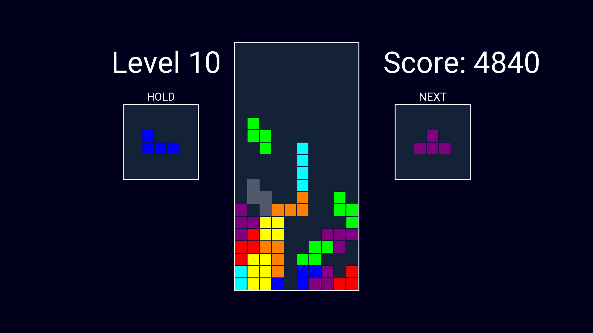

# Tetris SFML

A tetris clone, made with love using SFML.

## Instructions

- Press **Escape** to quit.

- Press **F11** to switch between fullscreen and windowed.

- Press **A** or **Left Arrow** to move left.

- Press **D** or **Right Arrow** to move right.

- Press **W** or **Up** Arrow to rotate counterclockwise.

- Press **Z** to rotate clockwise.

- Press **S** to soft drop.

- Press **Space** to hard drop.

- Press **R** to reset level.

- Press **C** to hold piece.

## Info

Every 500 score points, a new level awaits.



## Requirements

- **C++ 17** or higher

- **CMake**

- **MinGW C++ compiler** OR **MSVC**

- **Git**

- (Linux only) **Make**

## How to run

This project has a CMakeLists.txt ready, so u can make a build folder and configure with CMake.

```
mkdir build
cd build
cmake ..
```

On Windows:

```
cmake --build . --config Release
```

On Linux:

```
make
```

Output is in the /bin folder.
